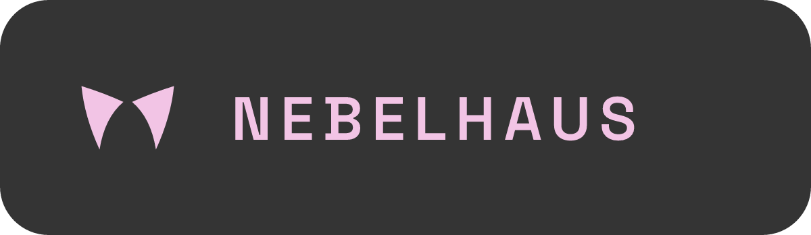
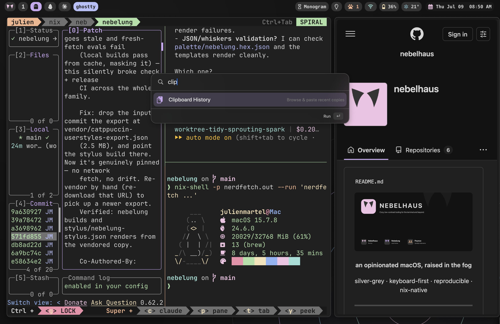
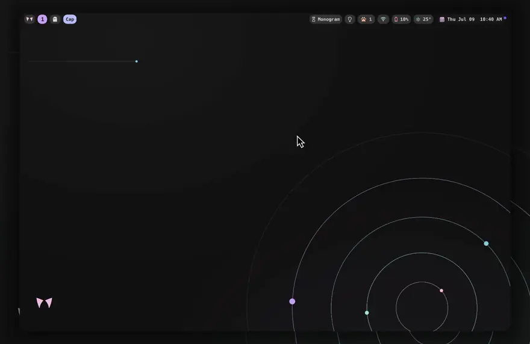

<div align="center">

<!-- identity banner — pink-on-gray wordmark (assets/nebelhaus-banner-gray-bg-rounded.png) -->


**an opinionated macOS, raised in the fog**

silver-grey · keyboard-first · reproducible · nix-native


<!-- assets/hero.png — the whole desktop: Sill bar, Prowl tiling, Pounce open, Nebelung everywhere -->


</div>

---

macOS, arranged like a tiling Linux rig but native to the grain of the Mac —
one Nix flake raises the whole house. Fog-grey, quiet, and reproducible: wipe
the machine, run one command, and the house stands again exactly as it was.

> [!TIP]
> Think *omarchy*, but for macOS instead of Arch.

<div align="center">

<!-- assets/tap-to-launch.webp — V3: tap ⇪, press a letter, the app launches and tiles itself -->


<sub>tap ⇪ → the bar sprouts letter-hints → press one → the app launches and tiles itself.</sub>

</div>

📖 **Full docs & guides: [nebelhaus.com](https://nebelhaus.com)** — start with
[Install](https://nebelhaus.com/start/install/) and [First run](https://nebelhaus.com/start/first-run/),
then the how-to guides: [Making it yours](https://nebelhaus.com/guides/making-it-yours/),
[Adding apps & tools](https://nebelhaus.com/guides/adding-apps/),
[Window management](https://nebelhaus.com/guides/window-management/), and
[Moving to a new Mac](https://nebelhaus.com/guides/new-mac/).

## the rooms

The house is built from composable nix-darwin modules. Take the whole thing, or
import one room into your own config.

- 🛖 **den** — the foundation — macOS defaults (dock/finder/trackpad/keyboard), the Homebrew framework + tap-trust, core CLI tools, fonts, weekly GC
- 🐈 **prowl** — opinionated [AeroSpace](https://github.com/nikitabobko/AeroSpace) tiling, launched via launchd (survives cold boot), Caps→F18 leader, wake-time window re-sort
- 🪟 **sill** — a [SketchyBar](https://github.com/FelixKratz/SketchyBar) setup perched on the top edge, with stray-agent eviction
- 🔥 **hearth** — the terminal experience — zsh, a Nebelung-tinted starship prompt, git, helix as the default editor, and a themed toolbelt (bat, delta, lazygit, lsd, yazi, zoxide, fzf), plus the ghostty / zellij / yazi dotfiles
- 🔖 **collar** — identity & auth — Touch ID for sudo (with `reattach`, so it works inside tmux/zellij)
- 🗝️ **secrets** — declarative secrets via [secretspec](https://secretspec.dev) — projects commit *which* secrets they need (never values); values live in the provider you pick per host: the local keychain by default, or 1Password / Bitwarden / GCP / AWS / Vault so they follow you to the next Mac
- 🐾 **pounce** — the [Pounce](https://github.com/nebelhaus/pounce) command palette, wired in as a self-signing daemon that holds its Accessibility grant across rebuilds, and ⌘Space freed for it
- 🐦 **trill** — the [Trill](https://github.com/nebelhaus/trill) native Messages client (iMessage/SMS/RCS over `chat.db`), installed as a Homebrew cask (`nebelhaus.trill.enable`)
- 🤫 **hush** — a one-switch Focus/DND: a declarative global hotkey, plus optional Slack status and shell hooks (`nebelhaus.hush.*`)
- 🎨 **theme** — the desktop wallpaper and an accent-derived bold wordmark (`nebelhaus.theme.accent` / `.wallpaper`)

Plus the theme, [**nebelung**](https://github.com/nebelhaus/nebelung) — a
silver-mist Catppuccin variant — and [**pounce**](https://github.com/nebelhaus/pounce),
both consumed as flake inputs.

## raise the whole house

```sh
curl -fsSL https://nebelhaus.com/init.sh | bash
# or straight from the flake, once nix is installed:
nix run github:nebelhaus/nebelhaus#bootstrap
```

It installs the prerequisites (Xcode CLT, Determinate Nix), then scaffolds a
**thin config of your own** at `~/.config/nix` — a ~18-line flake that consumes
this repo as an input, plus one host file for the personal bits. You never edit
this repo to use it; your machine stays yours, the rice stays upstream, and
`nix flake update nebelhaus` pulls new fog whenever you like.

It won't switch a config that isn't yours — you personalize the generated host
file first, then rebuild (always build-first):

```sh
cd ~/.config/nix
nix build .#darwinConfigurations.<hostname>.system \
  && sudo ./result/sw/bin/darwin-rebuild switch --flake .#<hostname>
```

That first switch puts a small **`haus`** CLI on your PATH, so from then on you
never type the incantation again:

```sh
haus rebuild        # build + switch this machine
haus update         # pull the latest rice, then rebuild
haus rollback       # go back a generation (haus generations lists them)
haus generations    # list past generations (the rollback targets)
haus status         # current generation + how old your pinned rice is
haus edit           # open your host config in $EDITOR
haus doctor         # check Nix, the CLT, the GUI agents, and Homebrew cask drift
haus btm            # on macOS Tahoe+, diagnose Background Task Management blocks on nix login items
haus tour           # a guided lap of the four moves, right in the bar
```

On a fresh machine the bar also shows a small "new here?" paw — click it and
the **haus tour** walks you through the four moves (launch, navigate, resize,
palette) live, advancing as it detects each one. Right-click hides it forever.

When to reach for each is covered in [Keeping in sync](https://nebelhaus.com/guides/staying-in-sync/).

## steal one room

Most rooms are exported as a `darwinModule` — den, hearth, prowl, sill, collar,
pounce, hush, secrets. Pull just what you want into your own flake (theme and
trill aren't standalone modules; they ride along with the full `mkNebelhaus`
house):

```nix
{
  inputs.nebelhaus.url = "github:nebelhaus/nebelhaus";

  # in your darwinSystem modules list:
  modules = [
    inputs.nebelhaus.darwinModules.prowl   # just the tiling
    inputs.nebelhaus.darwinModules.sill    # just the bar
    { nixpkgs.hostPlatform = "aarch64-darwin"; }  # rooms don't pick a platform for you
  ];
}
```

Or lean on the builder for the full rice:

```nix
darwinConfigurations.mymac = inputs.nebelhaus.mkNebelhaus {
  username = "ada";
  hostname = "mymac";
  host = ./hosts/mymac;
};
```

## identity is the only thing that's yours

nebelhaus ships everything — system *and* shell. The only things it leaves blank
are the bits that are personal to you: git name/email/signing key
(`nebelhaus.git.*`), the pounce signing identity, your secrets, and your private
app list. All of those live in your host file (`hosts/<hostname>/default.nix`) —
so the rice is complete out of the box, and you layer *you* on top. The
[Making it yours](https://nebelhaus.com/guides/making-it-yours/) guide is a
cookbook of every knob you can set there.

## identity

- **pounce signing** — set `nebelhaus.pounce.signingIdentity` to an Apple
  Development identity's SHA-1 (`security find-identity -v -p codesigning`) so
  the palette's Accessibility grant survives rebuilds. Leave empty to run
  unsigned. See the [pounce README](https://github.com/nebelhaus/pounce) for the
  one-time accessibility approval.
- **git / GPG / YubiKey** — commit signing is configured in your host's
  home-manager block; key material and any smartcard/YubiKey setup live outside
  Nix (gpg-agent + pinentry-mac).

## hack on the house

This repo is one of a family (`nebelung` the theme, `pounce` the palette,
this rice, and your own thin config on top). The
[workshop](https://github.com/nebelhaus/workshop) checks them all out side by
side and ships a `bench` CLI that handles the cross-repo flow — most usefully
`bench try`, which builds your real machine against your **local, uncommitted**
checkouts, so you never push to find out whether something works.

Iterating on a **zellij** edit (a keybind in `config.kdl`, a theme colour, a
freshly-built plugin `.wasm`) is even lighter: `zscratch` — a dev CLI shipped in
this repo's `modules/den` — boots your candidate in a throwaway session in its
own Ghostty window, so you feel the change without a rebuild or losing your
working session's tabs. `bench try switch` does the real activation once, at the
end. See [`CLAUDE.md`](./CLAUDE.md) for the full flag set.

## the fog

Grey is the point. Nebelung is a low-contrast, muted dark palette for people who
find Mocha too loud — a cat breed the colour of high fog, hence the name.

## license

MIT · built on [Nix](https://nixos.org), [nix-darwin](https://github.com/LnL7/nix-darwin),
[home-manager](https://github.com/nix-community/home-manager),
[AeroSpace](https://github.com/nikitabobko/AeroSpace),
[SketchyBar](https://github.com/FelixKratz/SketchyBar), and
[Catppuccin](https://github.com/catppuccin).
